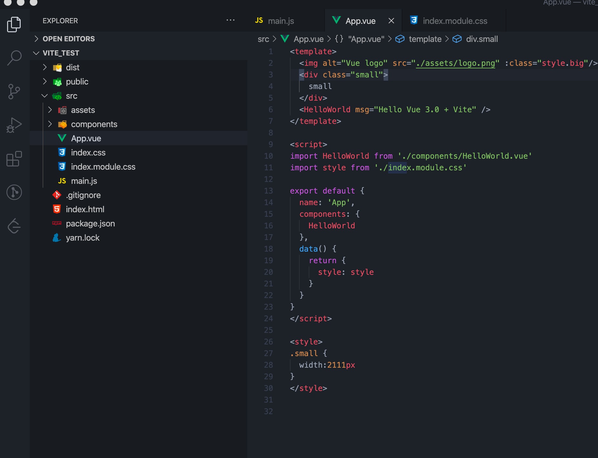
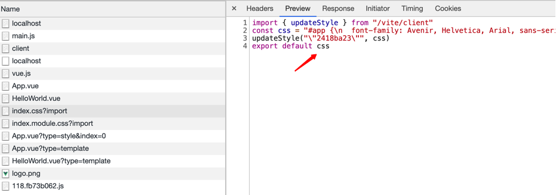
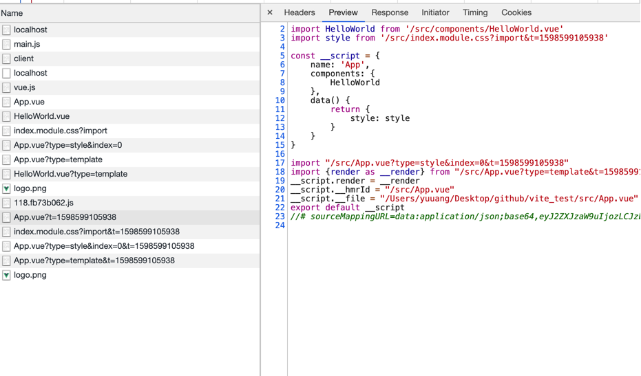
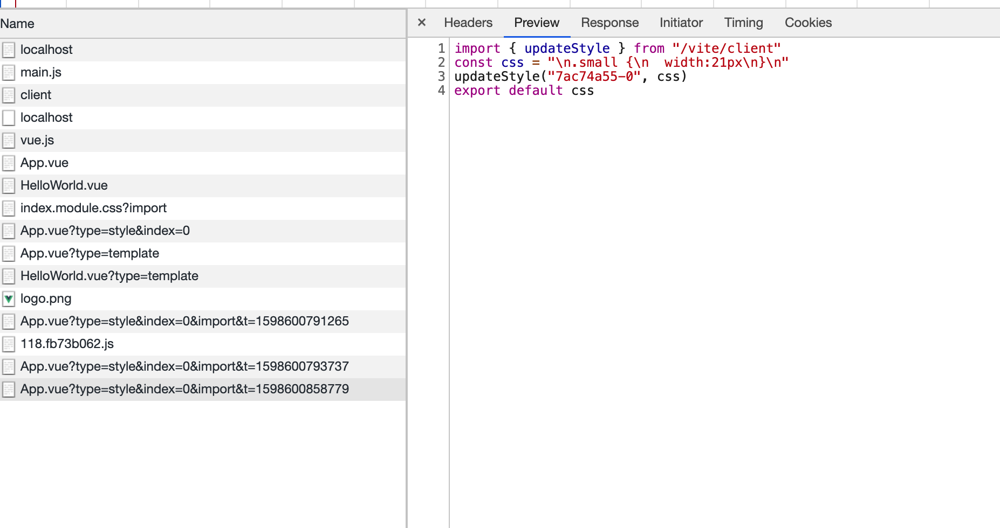
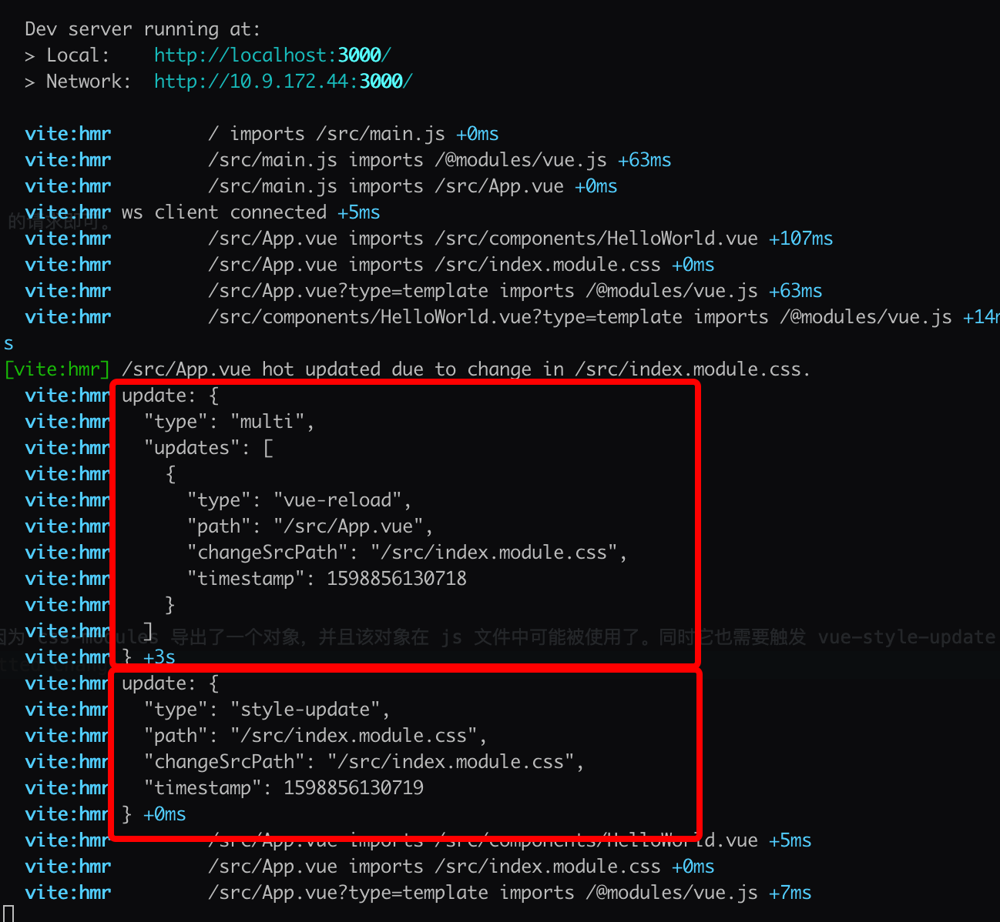

# 热替换

热替换(Hot Module Replacement) 指的是修改代码后无需刷新页面即可生效。经常跟 `Hot Module Reload` 搞混。一个成熟的框架是必须要具备热替换能力的。Vite 的热替换实现与业界知名的一些模块如 `webpack-dev-server` 的实现类似。本质都是通过 websocket 建立服务端与浏览器的通信。如果对 `WebSocket` 不了解的可能需要先去学习下相关知识点。这里我们将分别分析修改几种不同类型的文件如 `.vue`, `.js`, `.css` 文件的热替换机制在 Vite 是具体如何实现的。同时也会分析 Vite 提供的热替换相关的 API，如: `import.meta.hot`

## 监听文件变化

首先服务端向浏览器发送消息肯定是在文件有变动才发送。在 webpack 的生态中，大多数 middleware/plugin 都是通过监听 webpack 提供的一些钩子函数，如下方代码摘自 webpack-dev-server 源码：

```js
const addHooks = (compiler) => {
    const { compile, invalid, done } = compiler.hooks
    done.tap('webpack-dev-server', (stats) => {
        // 通过开启webpack --watch选项，在webpack每次编译完新的文件时，触发这个钩子，向sockjs发送新的message，内容为新的静态资源的hash
        // 在_sendStats方法末尾会根据当前编译情况发送error/warning/ok三种类型的message给client
        this._sendStats(this.sockets, this.getStats(stats))
    })
}
```

Node.js 本身提供了官方的 API 例如 fs.watch fs.watchFile 来监听文件的变化，Vite 则使用了这些 API 更上层的封装模块 [chokidar](https://www.npmjs.com/package/chokidar) 来进行文件系统的变动监听。

```js
// src/node/server/index.ts
// 监听整个项目根目录。忽略 node_modules 和 .git 文件夹
const watcher = chokidar.watch(root, {
    ignored: [/\bnode_modules\b/, /\b\.git\b/]
}) as HMRWatcher
```

## css 热替换

有两种情况都可以修改样式，一种是修改外部 css 源文件。例如 `import './index.css'`, 或者直接改 Vue 组件的 style 标签。这两种修改方式的热更新策略也不一样。

```js
  watcher.on('change', (filePath) => {
    if (isCSSRequest(filePath)) {
      const publicPath = resolver.fileToRequest(filePath)
      if (srcImportMap.has(filePath)) {
        // handle HMR for <style src="xxx.css">
        // it cannot be handled as simple css import because it may be scoped
        const styleImport = srcImportMap.get(filePath)
        vueCache.del(filePath)
        vueStyleUpdate(styleImport)
        return
      }
    }
  })
```

查看注释我们可以知道当我们使用 `<style src="xxx.css">` 这种方式来引入外部 css 文件，且文件变动时，需要执行 `vueStyleUpdate` 。我们不能简单的把它当作一个外部的 css 文件来处理。因为它可能是 scoped 局部作用域的。

```js
if (filePath.includes('.module')) {
  moduleCssUpdate(filePath, resolver)
}

const boundaries = getCssImportBoundaries(filePath)
if (boundaries.size) {
  for (let boundary of boundaries) {
    if (boundary.includes('.module')) {
      moduleCssUpdate(boundary, resolver)
    } else if (boundary.includes('.vue')) {
      vueCache.del(cleanUrl(boundary))
      vueStyleUpdate(resolver.fileToRequest(boundary))
    } else {
      normalCssUpdate(resolver.fileToRequest(boundary))
    }
  }
  return
}
// no boundaries
normalCssUpdate(publicPath)
```
### css 导入关系链

以以下代码为例


```js
const boundaries = getCssImportBoundaries(filePath)
```

这一行代码就是获取当前文件在 css 层级被导入关系链。包括独立的 css 文件以及 vue 组件的 style 标签
举个例子

```js
// src/index.module.css
.big {
  width: 200px
}
// src/index.css
@import './index.module.css';

```

这时候 index.module.css 就是 index.css 的依赖(dependencies), Vite 会生成两个 Map 对象分别存储导入者，和被导入者的依赖关系

```js
// cssImporterMap 被导入关系链
Map(1) {
  '/Users/yuuang/Desktop/github/vite_test/src/index.module.css' => Set(1) { '/Users/yuuang/Desktop/github/vite_test/src/index.css' }
}
// cssImporteeMap 导入关系链
Map(3) {
  '/Users/yuuang/Desktop/github/vite_test/src/App.vue?type=style&index=0' => Set(0) {},
  '/Users/yuuang/Desktop/github/vite_test/src/index.module.css' => Set(0) {},
  '/Users/yuuang/Desktop/github/vite_test/src/index.css' => Set(1) {
    '/Users/yuuang/Desktop/github/vite_test/src/index.module.css'
  }
}
```

举个例子。当我们修改 `src/index.module.css` 时，那么依赖这个文件的文件都需要根据以下策略进行对应的更新。  
即修改 `src/index.module.css` 时， `src/index.css` 也需要更新

我们可以看到 css 的更新策略分为三种

1、`normalCssUpdate:` 普通的外部 css 文件更新 例如 `import './index.css'`   
2、`moduleCssUpdate:` 当 import 的 css 文件包含 .module 关键字时文件变动时, 或者 被导入关系链上含有 .module 文件。  
3、`vueStyleUpdate:` 当通过 `<style src="xxx.css">` 这种方式导入的文件变动时，或者被导入关系链上含有 .vue 文件  

接下来让我们分别分析三种更新策略的具体行为

### normalCssUpdate

普通的外部 css 文件更新例如 `import './index.css'`

```js
function normalCssUpdate(publicPath: string) {
  // bust process cache
  processedCSS.delete(publicPath)

  watcher.send({
    type: 'style-update',
    path: publicPath,
    changeSrcPath: publicPath,
    timestamp: Date.now()
  })
}

```

通过 WebSocket 向浏览器发送了类型为 `style-update` 的消息并且附带修改的文件地址 `src/index.css`

```js
 case 'style-update':
      // check if this is referenced in html via <link>
      const el = document.querySelector(`link[href*='${path}']`)
      if (el) {
        el.setAttribute(
          'href',
          `${path}${path.includes('?') ? '&' : '?'}t=${timestamp}`
        )
        break
      }
      // imported CSS
      const importQuery = path.includes('?') ? '&import' : '?import'
      await import(`${path}${importQuery}&t=${timestamp}`)
      console.log(`[vite] ${path} updated.`)
      break
```

浏览器接收到该消息后做的事情也非常简单，根据传入的 path 在后面拼接上类型为 import 的 query 参数。并且附上时间参数 t 防止被缓存。接着使用 import 关键字让浏览器发起一个最新的 css 文件的请求
`/src/index.css?import&t=1598530856590`

### moduleCssUpdate

针对使用了 [css-modules](https://github.com/css-modules/css-modules) 的文件的更新  
首先要对 css-modules 有个基本的了解。如果没有开启 css-modules, 当我们使用 `import style from './index.css'`时，并不能得到具体的对象。在 Vite 中针对这种普通 css 文件将会导出 css 字符串。  

当我们开启 css-modules 后，通过 `import style from './index.module.css'` 可以得到具体的 css 类名关系映射对象


```js
function moduleCssUpdate(filePath: string, resolver: InternalResolver) {
  // bust process cache
  processedCSS.delete(resolver.fileToRequest(filePath))

  watcher.handleJSReload(filePath)
}
```
因为启动了 css-modules 实质是导出一个对象。我们可以把这个文件当作 js 文件来看待。所以更新策略与我们后面讲到的 js 文件的热更新策略是一样的，接着让我们看看 handleJSReload 究竟干了什么

```js
 const handleJSReload = (watcher.handleJSReload = (
    filePath: string,
    timestamp: number = Date.now()
  ) => {
    const publicPath = resolver.fileToRequest(filePath)
    const importers = importerMap.get(publicPath)
  })

```

首先获取被导入关系链，找到依赖 `index.module.css` 的文件，这里的 importers 是 App.vue  

```js
const dirtyFiles = new Set<string>()
dirtyFiles.add(publicPath)

const hasDeadEnd = walkImportChain(
  publicPath,
  importers || new Set(),
  hmrBoundaries,
  dirtyFiles
)
```
我们将当前文件 `src/index/module.css` 加入脏文件的集合当中，因为当前文件需要修改。接着我们通过 walkImportChain 顾名思义，遍历导入链。做一些信息收集操作。并且判断需不需要页面的全量更新即页面刷新。这里的 importers 导入链只包含直接使用 import 关键字的文件。比如在 App.vue 中 `import style from './index.module.css'` 或者 main.js 中 `import style from './index.module.css'`。如果是在另一个 css 文件通过 `@import './index.module.css'` 的方式导入则不会被计入导入链

```js
// 在这个例子里我们称 App.vue 为导入模块 称 index.module.css 为被导入模块
function walkImportChain(
  importee: string,
  importers: Set<string>,
  hmrBoundaries: Set<string>,
  dirtyFiles: Set<string>,
  currentChain: string[] = []
): boolean {
  if (hmrDeclineSet.has(importee)) {
    // 如果模块明确通过 import.meta.hot.decline 拒绝热更新，则直接页面刷新返回 true
    return true
  }

  if (isHmrAccepted(importee, importee)) {
    // 如果模块通过 import.meta.hot.accept 接收自身的更新则直接返回 false 不需要刷新
    hmrBoundaries.add(importee)
    dirtyFiles.add(importee)
    return false
  }
  for (const importer of importers) {
    if (
      importer.endsWith('.vue') ||
      // 如果导入模块 通过 import.meta.hot.acceptDeps 接收了被导入模块的更新通知
      isHmrAccepted(importer, importee) ||
      // 如果导入模块通过 import.meta.hot.accept 接收自身的更新
      isHmrAccepted(importer, importer)
    ) {
      // 如果导入模块是 vue 组件，则添加进 脏文件，代表此文件需要被更新
      if (importer.endsWith('.vue')) {
        dirtyFiles.add(importer)
      }
      hmrBoundaries.add(importer)
      currentChain.forEach((file) => dirtyFiles.add(file))
    } else {
      // 如果导入模块不是 vue 组件则走else分支
      // 这里的导入模块可以是 js 文件，比如我们在 main.js 里面 import style from './index.module.css'
      // 如果走到了这个else分支且没有更上层的导入模块。则认为该模块的导入链都是js文件且最上层的文件是main.js。这种情况需要整个页面刷新
      const parentImpoters = importerMap.get(importer)
      if (!parentImpoters) {
        return true
      } else if (!currentChain.includes(importer)) {
        // 如果有更上层的导入模块则继续递归判断上层模块一直往上找
        if (
          walkImportChain(
            importer,
            parentImpoters,
            hmrBoundaries,
            dirtyFiles,
            currentChain.concat(importer)
          )
        ) {
          return true
        }
      }
    }
  }
  return false
}
```
结合上面的分析，其实我们只需要关注什么情况下会返回 true 的情况即可。因为这种情况需要整个页面 reload。大部分情况下我们都不会走到这个逻辑。即只有当你修改的文件的最顶层导入模块是 main.js 的时候才需要进行页面的 reload

```js
if (hasDeadEnd) {
  send({
    type: 'full-reload',
    path: publicPath
  })
  console.log(chalk.green(`[vite] `) + `page reloaded.`)
}
```

如果 hasDeadEnd 为 true 则进行整个页面的 reload

```js
const boundaries = [...hmrBoundaries]
  const file =
    boundaries.length === 1 ? boundaries[0] : `${boundaries.length} files`
  console.log(
    chalk.green(`[vite:hmr] `) +
      `${file} hot updated due to change in ${relativeFile}.`
  )
  send({
    type: 'multi',
    updates: boundaries.map((boundary) => {
      return {
        type: boundary.endsWith('vue') ? 'vue-reload' : 'js-update',
        path: boundary,
        changeSrcPath: publicPath,
        timestamp
      }
    })
  })
```

接着是不需要全量更新的情况。处理方式也很简单。我们遍历导入链。根据链上的每个文件的类型，发送对应的更新消息给客户端。这里我们的导入链上只有 App.vue。  
所以发送 vue-reload 的消息
```js
case 'vue-reload':
      queueUpdate(
        import(`${path}?t=${timestamp}`)
          .catch((err) => warnFailedFetch(err, path))
          .then((m) => () => {
            __VUE_HMR_RUNTIME__.reload(path, m.default)
            console.log(`[vite] ${path} reloaded.`)
          })
      )
      break
```
这里维护了一个队列，来保证组件的更新顺序是先进先出。


可以看到页面重新请求了一个新的 App.vue 文件。且由于这个新文件的代码中包含新的带有时间参数t的 index.module.css 请求。所以我们也同样发起请求获取了新的 index.module.css 文件。

### vueStyleUpdate

修改 vue 组件 style 标签样式

```js
  function vueStyleUpdate(styleImport: string) {
    const publicPath = cleanUrl(styleImport)
    const index = qs.parse(styleImport.split('?', 2)[1]).index
    const path = `${publicPath}?type=style&index=${index}`
    console.log(chalk.green(`[vite:hmr] `) + `${publicPath} updated. (style)`)
    watcher.send({
      type: 'style-update',
      path,
      changeSrcPath: path,
      timestamp: Date.now()
    })
  }
```

处理方式也非常简单。找到修改的具体组件发起新的请求且请求类型为 style

可以看的新的请求只包含我们修改的新样式

## js 热替换

js 文件的热更新其实在上面分析 css-modules 时已经顺带提到了。会被 handleJSReload
这个方法处理。处理结果也是两种

- 导入链最上层是 main.js 这种情况页面 reload
- 不需要全量更新，根据导入链发起新文件的请求

## vue 组件热替换

vue 组件的热替换分为以下几种情况

- `vue-rerender` 只发起请求类型为 template 的请求。无需请求整个完整的新组件
- `vue-reload` 发起新组件的完整请求
- `style-update` style 标签更新
- `style-remove` style 标签移除

接下来我们来分析每种情况的更新时机

### 更新类型

发起新组件的完整请求

```js
//src/node/server/serverPluginVue.ts
watcher.on('change', (file) => {
  if (file.endsWith('.vue')) {
    handleVueReload(file)
  }
})
```

vue 文件修改时触发 handleVueReload 方法

```js
const descriptor = await parseSFC(root, filePath, content)
```
首先用官方提供的库来将单文件组件编译成 descriptor。这里我们摘出比较重要的信息省略 sourcemap信息。

```js
{
  filename: '/Users/yuuang/Desktop/github/vite_test/src/App.vue',
  source: '<template>\n' +
    '  \n' +
    '  <div class="small">\n' +
    '    small1\n' +
    '  </div>\n' +
    '  <HelloWorld msg="Hello Vue 3.0 + Vite" />\n' +
    '</template>\n' +
    '\n' +
    '<script>\n' +
    "import HelloWorld from './components/HelloWorld.vue'\n" +
    "import style from './index.module.css'\n" +
    '\n' +
    'export default {\n' +
    "  name: 'App',\n" +
    '  components: {\n' +
    '    HelloWorld\n' +
    '  },\n' +
    '  data() {\n' +
    '    return {\n' +
    '      style: style\n' +
    '    }\n' +
    '  },\n' +
    '  mounted () {\n' +
    "    console.log('mounted')\n" +
    '  }\n' +
    '}\n' +
    '</script>\n' +
    '\n' +
    '<style>\n' +
    '.small {\n' +
    '  width:21px\n' +
    '}\n' +
    '</style>\n' +
    '\n',
  template: {
    type: 'template',
    content: '\n' +
      '  \n' +
      '  <div class="small">\n' +
      '    small1\n' +
      '  </div>\n' +
      '  <HelloWorld msg="Hello Vue 3.0 + Vite" />\n',
    loc: {
      source: '\n' +
        '  \n' +
        '  <div class="small">\n' +
        '    small1\n' +
        '  </div>\n' +
        '  <HelloWorld msg="Hello Vue 3.0 + Vite" />\n',
      start: [Object],
      end: [Object]
    },
    attrs: {},
    map: xxx
  },
  script: {
    type: 'script',
    content: '\n' +
      "import HelloWorld from './components/HelloWorld.vue'\n" +
      "import style from './index.module.css'\n" +
      '\n' +
      'export default {\n' +
      "  name: 'App',\n" +
      '  components: {\n' +
      '    HelloWorld\n' +
      '  },\n' +
      '  data() {\n' +
      '    return {\n' +
      '      style: style\n' +
      '    }\n' +
      '  },\n' +
      '  mounted () {\n' +
      "    console.log('mounted')\n" +
      '  }\n' +
      '}\n',
    loc: {
      source: '\n' +
        "import HelloWorld from './components/HelloWorld.vue'\n" +
        "import style from './index.module.css'\n" +
        '\n' +
        'export default {\n' +
        "  name: 'App',\n" +
        '  components: {\n' +
        '    HelloWorld\n' +
        '  },\n' +
        '  data() {\n' +
        '    return {\n' +
        '      style: style\n' +
        '    }\n' +
        '  },\n' +
        '  mounted () {\n' +
        "    console.log('mounted')\n" +
        '  }\n' +
        '}\n',
      start: [Object],
      end: [Object]
    },
    attrs: {},
    map: xxx
  },
  scriptSetup: null,
  styles: [
    {
      type: 'style',
      content: '\n.small {\n  width:21px\n}\n',
      loc: [Object],
      attrs: {},
      map: [Object]
    }
  ],
  customBlocks: []
}
```
拿到 parse 之后的组件 descriptor 后 我们继续往下看

```js
const prevDescriptor = cacheEntry && cacheEntry.descriptor
if (!prevDescriptor) {
  // the file has never been accessed yet
  debugHmr(`no existing descriptor found for ${filePath}`)
  return
}
```

从缓存中读取之前的组件缓存。如果没有则说明该组件还没有被渲染。什么都不用做。这里解释一下什么情况下会走到这里。当我们启动本地服务，但是并没有真正访问过该服务时。此时所有的文件缓存除了预优化的部分 都是 undefined，
这时候我们直接修改组件会走到此 if 分支。

```js
if (
  !isEqualBlock(descriptor.script, prevDescriptor.script) ||
  !isEqualBlock(descriptor.scriptSetup, prevDescriptor.scriptSetup)
) {
  return sendReload()
}
function isEqualBlock(a: SFCBlock | null, b: SFCBlock | null) {
  // 首先比较两个对象的src属性，如果一样直接返回true
  // 接着遍历两个对象的 attrs 进行比较
  if (!a && !b) return true
  if (!a || !b) return false
  if (a.src && b.src && a.src === b.src) return true
  if (a.content !== b.content) return false
  const keysA = Object.keys(a.attrs)
  const keysB = Object.keys(b.attrs)
  if (keysA.length !== keysB.length) {
    return false
  }
  return keysA.every((key) => a.attrs[key] === b.attrs[key])
}
```

第一种需要重新 vue-reload 的情况，当我们同一个组件前后两次渲染时的 script 或者 scriptSetup 不一致时，需要重新 load 整个组件。[setup](https://juejin.im/post/6844903877574295560) 是 Vue3 中新提出的特性。如果前后组件的 script* 相等，则继续往下判断。  

```js
if (!isEqualBlock(descriptor.template, prevDescriptor.template)) {
  needRerender = true
}
```

接下来判断如果前后的 template 不一致，则发送 vue-rerender 消息。只需要发起 type 为 template 的请求即可。  
接下来是进行 style 的分析

```js
// css modules update causes a reload because the $style object is changed
// and it may be used in JS. It also needs to trigger a vue-style-update
// event so the client busts the sw cache.
if (
  prevStyles.some((s) => s.module != null) ||
  nextStyles.some((s) => s.module != null)
) {
  return sendReload()
}
```

如果应用了 css-modules 的 css 文件内容更新了则需要 vue-reload。 通过注释我们也可以看出原因。因为 css-modules 导出了一个对象，并且该对象在 js 文件中可能被使用了。同时它也需要触发 vue-style-update 类型的消息去清楚之前的 service worker 的缓存的文件。

可以看到当我们修改 index.module.css 文件时，发送了两个消息分别是 vue-reload以及 style-update

```js
// force reload if CSS vars injection changed
if (
  prevStyles.some((s, i) => {
    const next = nextStyles[i]
    if (s.attrs.vars && (!next || next.attrs.vars !== s.attrs.vars)) {
      return true
    }
  })
) {
  return sendReload()
}
```
如果 inject 注入的 css 变量改变, 触发 vue-reload

```js
// force reload if scoped status has changed
if (prevStyles.some((s) => s.scoped) !== nextStyles.some((s) => s.scoped)) {
  return sendReload()
}
```
如果 scoped 属性发生了变化，触发 vue-reload

```js
// only need to update styles if not reloading, since reload forces
// style updates as well.
nextStyles.forEach((_, i) => {
  if (!prevStyles[i] || !isEqualBlock(prevStyles[i], nextStyles[i])) {
    didUpdateStyle = true
    const path = `${publicPath}?type=style&index=${i}`
    send({
      type: 'style-update',
      path,
      changeSrcPath: path,
      timestamp
    })
  }
})
```
如果组件前后的 descriptor 的 styles 属性不相等且不涉及其他会触发 vue-reload 的条件，此时发送 style-update 消息。

```js
// stale styles always need to be removed
prevStyles.slice(nextStyles.length).forEach((_, i) => {
  didUpdateStyle = true
  send({
    type: 'style-remove',
    path: publicPath,
    id: `${styleId}-${i + nextStyles.length}`
  })
})
```
如果组件前后的 styles 属性长度不一致。通常是移除了整个 style 标签。此时需要发送 style-remove 消息

```js
const prevCustoms = prevDescriptor.customBlocks || []
const nextCustoms = descriptor.customBlocks || []

// custom blocks update causes a reload
// because the custom block contents is changed and it may be used in JS.
if (
  nextCustoms.some(
    (_, i) =>
      !prevCustoms[i] || !isEqualBlock(prevCustoms[i], nextCustoms[i])
  )
) {
  return sendReload()
}
```
如果自定义块发生了改变则需要 vue-reload。因为自定义块在 js 中可能被使用。

### 客户端接收消息

上面提到了各种情况我们向客户端浏览器发送的消息类型。下面我们看看浏览器接收到这些类型的消息后分别做了什么事情

#### vue-reload

比较简单。直接发起新的带有 t 参数的组件请求

```js
case 'vue-reload':
      queueUpdate(
        import(`${path}?t=${timestamp}`)
          .catch((err) => warnFailedFetch(err, path))
          .then((m) => () => {
            __VUE_HMR_RUNTIME__.reload(path, m.default)
            console.log(`[vite] ${path} reloaded.`)
          })
      )
      break
```

#### vue-rerender

如上面提到的，vue-rerender 只需要发起 type 为 template 的组件请求即可

```js
case 'vue-rerender':
    const templatePath = `${path}?type=template`
    import(`${templatePath}&t=${timestamp}`).then((m) => {
      __VUE_HMR_RUNTIME__.rerender(path, m.render)
      console.log(`[vite] ${path} template updated.`)
    })
    break
```

#### style-remove

style-update 在 css 热替换时已经介绍了。这里介绍 style-remove,其实本质跟 style-update 差不多。

```js
case 'style-remove':
    removeStyle(payload.id)
    break
function removeStyle(id: string) {
  let style = sheetsMap.get(id)
  if (style) {
    if (style instanceof CSSStyleSheet) {
      // @ts-ignore
      const index = document.adoptedStyleSheets.indexOf(style)
      // @ts-ignore
      document.adoptedStyleSheets = document.adoptedStyleSheets.filter(
        (s: CSSStyleSheet) => s !== style
      )
    } else {
      document.head.removeChild(style)
    }
    sheetsMap.delete(id)
  }
}
```

通过传入的文件对应的 hashid。在当前文档的 CSSStyleSheet 中移除该样式。  

### 总结

综上我们可以总结出不同的消息的触发情况 

#### vue-reload

- script 或者 sctiptSetup 改变
- css-modules 文件改变
- css vars 改变
- scoped 改变
- customBlocks 自定义块改变

#### vue-rerender

- template 改变且不涉及其他会触发 vue-reload 的条件

#### style-update 

- 组件前后的 descriptor 的 styles 属性不相等且不涉及其他会触发 vue-reload 的条件，此时发送 style-update 消息

#### style-remove

- 移除了整个 style 标签。此时需要发送 style-remove 消息