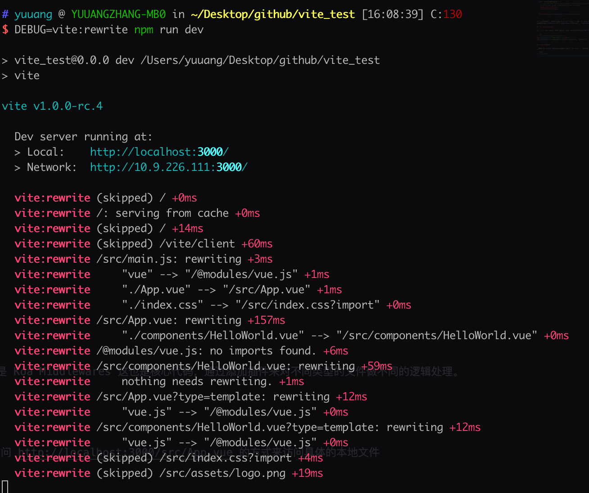
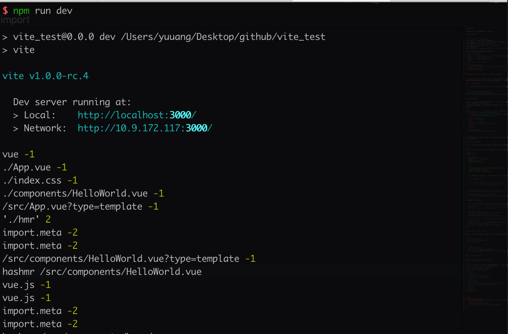
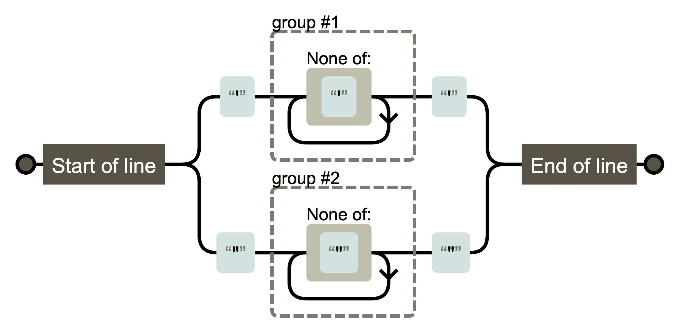
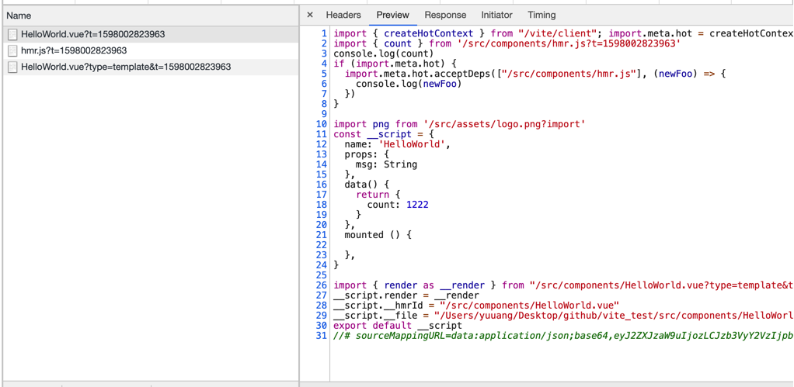
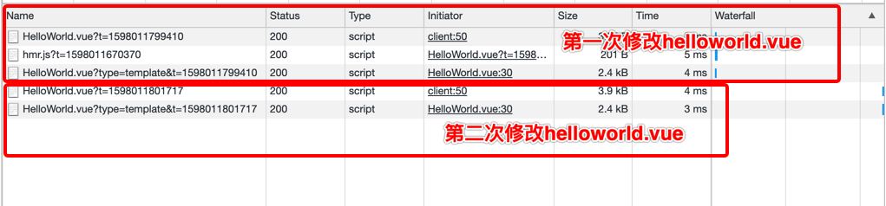

# 模块解析

本章介绍 Vite 的核心模块加载解析机制

## 启动 Koa 服务

```js
// src/index.ts 省略部分代码
const app = new Koa<State, Context>()
const server = resolveServer(config, app.callback())
const watcher = chokidar.watch(root, {
  ignored: [/\bnode_modules\b/, /\b\.git\b/]
}) as HMRWatcher
const resolver = createResolver(root, resolvers, alias) // 解析模块逻辑

const context: ServerPluginContext = {
  root, // 项目根目录
  app, // Koa 实例
  server, // 自定义的 server 主要服务 https/http2.0 的情况
  watcher, // 本地文件的watcher
  resolver, // 定义模块的解析逻辑
  config,
  port: config.port || 3000
}
const resolvedPlugins = [
  // 这里加载一堆插件，本质是 Koa 中间件增强服务端能力
  moduleRewritePlugin,
  moduleResolvePlugin,
  ...
]
resolvedPlugins.forEach((m) => m && m(context))
```

通过上述代码我们可以看到了 Vite 通过 Koa 启动了一个 http 服务，并且加载了一堆插件。插件的本质是 Koa Middlewares 这也是核心代码，通过添加插件来对不同类型的文件做不同的逻辑处理。
模块的解析机制的相关插件是 moduleRewritePlugin 和 moduleResolvePlugin

## 添加静态目录功能

通过使用 koa-static 来将 public 目录 以及整个根目录设置为静态资源目录，使得我们可以直接通过访问 http://localhost:3000/src/App.vue 的方式来访问具体的本地文件

```js
// src/serverPluginServeStatic.ts
app.use(require('koa-static')(root))
app.use(require('koa-static')(path.join(root, 'public')))
```

## 模块路径重写

这里我们分析的核心文件是 `src/node/server/serverPluginModuleRewrite.ts`。 原生的 ES module 不支持裸模块的导入，所以 Vite 进行了模块加载路径的重写。这里我们可以通过使用 debug 模块的功能来总览 Vite 到底重写了哪些路径

通过 debug 模块的输出我们可以很直观的发现  "vue" --> "/@modules/vue.js", 至于其他的导入路径也被重写了例如 "./App.vue" --> "/src/App.vue" 则是为了让 Vite 更方便的找到模块的具体绝对路径。

```js
await initLexer // 初始化 es-module-lexer 进行词法分析
const importer = removeUnRelatedHmrQuery(
    // removeUnRelatedHmrQuery 移除无关的HMR请求后面的query参数
    resolver.normalizePublicPath(ctx.url)
)
ctx.body = rewriteImports(
    root,
    content!, // 文件源码
    importer, // 需要从源文件中替换的路径
    resolver,
    ctx.query.t
)
if (!isHmrRequest) {
    rewriteCache.set(cacheKey, ctx.body)
}
```

在 rewriteImports 方法中 Vite 使用了 esbuild 提供的 [es-module-lexer](https://www.npmjs.com/package/es-module-lexer) 来进行词法分析。并且将最终已经 replace 模块路径的结果赋值给 ctx.body

### es-module-lexer

通过阅读 es-module-lexer 的文档我们可以发现它是用来分析代码中的模块加载导出关系的。

```js
import { init, parse } from 'es-module-lexer/dist/lexer.js';
 
(async () => {
  await init;
 
  const source = `
    import { a } from 'asdf';
    export var p = 5;
    export function q () {
 
    };
 
    // Comments provided to demonstrate edge cases
    import('dynamic').then();
    import /*comment!*/.meta.asdf;
  `;
 
  const [imports, exports] = parse(source, 'optional-sourcename');

  console.log(imports)
  // [
  //   { s: 24, e: 28, ss: 5, se: 29, d: -1 },
  //   { s: 190, e: 199, ss: 183, se: 0, d: 183 },
  //   { s: 213, e: 237, ss: 213, se: 237, d: -2 }
  // ]
 
  // Returns "asdf"
  source.substring(imports[0].s, imports[0].e); // 通过 start end 获取具体的 import path
 
  // Returns "import { a } from 'asdf';"
  source.substring(imports[0].ss, imports[0].se); // 获取完整的 import 语句
 
  // Returns "p,q"
  exports.toString();
 
  // Dynamic imports are indicated by imports[1].d > -1
  // In this case the "d" index is the start of the dynamic import
  // Returns true
  imports[1].d > -1; // 用来判断是否是动态加载，d 是动态加载的开始位
 
  // Returns "'asdf'"
  source.substring(imports[1].s, imports[1].e);
  // Returns "import /*comment!*/ ("
  source.substring(imports[1].d, imports[1].s);
 
  // import.meta is indicated by imports[2].d === -2
  // Returns true
  imports[2].d === -2; // 用来判断是否是 import.meta
  // Returns "import /*comment!*/.meta"
  source.substring(imports[2].s, imports[2].e);
})();
```

### 重写普通/动态的 import 

这里我们借助上文提到的 es-module-lexer 对模块的 source 源码进行词法分析。为了更全面的了解，这里我们写一个动态 import 的代码用于测试

```js
// src/helloword.vue
import('./hmr').then(res => {
  console.log(res)
})

// src/hmr.js
if (import.meta.hot) {
  import.meta.hot.accept((newModule) => {
    console.log('updated: count is now ', newModule.count)
  })
}
export const count=1
```

在源码中打印一下此时的依赖收集结果

```js
const { s: start, e: end, d: dynamicIndex } = imports[i]
let id = source.substring(start, end)
let hasLiteralDynamicId = false
console.log(id, dynamicIndex)
```



通过上面对 lexer 的介绍。我们知道当 dynamicIndex > -1 时代表是 dyanmic import。这里我们的 './hmr' > -1
所以针对这种导入。我们需要用正则来将 ' 符号中的具体路径提取出来

```js
if (dynamicIndex >= 0) {
  const literalIdMatch = id.match(/^(?:'([^']+)'|"([^"]+)")$/)
  if (literalIdMatch) {
    hasLiteralDynamicId = true
    id = literalIdMatch[1] || literalIdMatch[2]
  }
}
```

`/^(?:'([^']+)'|"([^"]+)")$/` 的正则提取用可视化工具 [regexper](https://regexper.com) 观察一下可以发现是用来提取 `'内容'` 或者 `"内容"` 中的具体内容


接着来我们处理正常的 import 以及经过正则处理过后的 dynamic import。import.meta.hot 以及 import.meta.env 在后续进行处理。

```js
if (dynamicIndex === -1 || hasLiteralDynamicId) {
  // do not rewrite external imports
}
```

如果模块是外部模块则不进行处理

```js
const externalRE = /^(https?:)?\/\//
const isExternalUrl = (url: string) => externalRE.test(url)
if (isExternalUrl(id)) {
  continue
}
```

通过原 id 获得 rewrite 之后的 resolved

```js
const resolved = resolveImport(
  root,
  importer,
  id,
  resolver,
  timestamp
)
export const resolveImport = (
root: string,
importer: string,
id: string,
resolver: InternalResolver,
timestamp?: string
): string => {
id = resolver.alias(id) || id

if (bareImportRE.test(id)) {
  // vue => /@modules/vue.js
  // 处理裸模块。从模块的 package.json 中找到entry字段并且返回，这里 Vue 的 entry 是 '@vue/shared/dist/shared.esm-bundler.js',
  // 由于 Vite 在预优化时对所有 package.json 中的 dependencies 模块进行了预优化，所以返回的是统一 optimize 后的路径，这里会在预优化章节进行解析
  id = `/@modules/${resolveBareModuleRequest(root, id, importer, resolver)}`
} else {
  // 相对路径转绝对路径
  let { pathname, query } = resolver.resolveRelativeRequest(importer, id)
  // 2. resolve dir index and extensions.
  // 标准化路径，兼容不同的操作系统
  pathname = resolver.normalizePublicPath(pathname)

  // 3. mark non-src imports
  // 记录没有query参数且后缀名不是js的操作。例如 import './index.css' import png from 'xxx.png' 在后面加上 import query
  if (!query && path.extname(pathname) && !jsSrcRE.test(pathname)) {
    query += `?import`
  }

  id = pathname + query
}
// 4. force re-fetch dirty imports by appending timestamp
if (timestamp) {
  // 在 模块 文件更新时在链接后面加上 t 参数防止浏览器缓存
  const dirtyFiles = hmrDirtyFilesMap.get(timestamp)
  const cleanId = cleanUrl(id)
  // only rewrite if:
  if (dirtyFiles && dirtyFiles.has(cleanId)) {
    // 1. this is a marked dirty file (in the import chain of the changed file)
    // 标志是来自脏文件的更新
    console.log('dirty', id, timestamp)
    id += `${id.includes(`?`) ? `&` : `?`}t=${timestamp}`
  } else if (latestVersionsMap.has(cleanId)) {
    // 2. this file was previously hot-updated and has an updated version
    id += `${id.includes(`?`) ? `&` : `?`}t=${latestVersionsMap.get(cleanId)}`
  }
}
return id
}

```

#### 来自接收模块的更新

这里写了个例子来验证什么情况下是脏文件的更新, 什么情况是latestVersionsMap

```js
// src/components/helloworld.vue
import { count } from './hmr'
console.log(count) // 这里注意必须引用count，否则 helloworld.vue 无法接收到count的更新callback
if (import.meta.hot) {
  import.meta.hot.acceptDeps(['./hmr.js'], (newFoo) => {
    console.log(newFoo)
  })
}
// src/components/hmr.js
export const count = 1
```

修改 hmr.js 后可以看到浏览器发起了三个请求

并且在终端中输出了以下信息

```bash
[vite:hmr] /src/components/HelloWorld.vue hot updated due to change in /src/components/hmr.js.
dirty /src/components/hmr.js 1598002823963
dirty /src/components/HelloWorld.vue?type=template 1598002823963
```

这里我们可以看到由于我们修改了 hmr.js 所以首先被文件 watcher 检测到了触发了 serverPluginHmr.ts 中的 handleJSReload 方法。这块我们后续会在热替换章节进行更细致的分析。

```js
send({
  type: 'multi',
  updates: boundaries.map((boundary) => {
    return {
      type: boundary.endsWith('vue') ? 'vue-reload' : 'js-update',
      path: boundary,
      changeSrcPath: publicPath,
      timestamp
    }
  })
```
在 handleJSReload 中我们收集了接收 hmr.js 更新的模块。在这个例子里面是 helloworld.vue。 所以通过 socket 向客户端发送了类型为 `vue-reload` 的消息。此时浏览器去加载了新的 `http://localhost:3000/src/components/HelloWorld.vue?t=1598002823963` 组件。

```js
if (timestamp) {
  const dirtyFiles = hmrDirtyFilesMap.get(timestamp)
  const cleanId = cleanUrl(id)
  // only rewrite if:
  if (dirtyFiles && dirtyFiles.has(cleanId)) {
    // 1. this is a marked dirty file (in the import chain of the changed file)
    id += `${id.includes(`?`) ? `&` : `?`}t=${timestamp}`
  } else if (latestVersionsMap.has(cleanId)) {
    console.log('last', id)
    // 2. this file was previously hot-updated and has an updated version
    id += `${id.includes(`?`) ? `&` : `?`}t=${latestVersionsMap.get(cleanId)}`
  }
}
```
这时候我们的新请求的 query 参数中含有 timestamp 这个参数了。并且在 handleJSReload 中，我们在 hmrDirtyFilesMap 把 hmr.js set进了 dirtyFiles。所以这里我们走到了 if 分支。在 hmr.js 的 path 后面加上了 t 参数。最后一个 type 为 template 的请求我们在后续组件渲染的章节进行讲解。  
简单总结一下当我们使用 import.meta.hot 接收了某个模块的更新后，当它更新时，会触发 dirtyFiles 的逻辑

#### 模块自身的更新

至于下面的 else 分支我们修改 helloworld.vue 时会触发 serverPluginVue.ts 的文件监控，进而发送 `vue-reload` 消息，让客户端进行新的 helloworld.vue 文件的请求。并且由于 Vite 本身的缓存机制，这里我们只有在第一次修改 helloworld.vue 时才会发起对 hmr.js 的实际请求。之后 Vite 检测到 hmr.js 文件并没有修改就不会再发起新的请求了。
即在模块因为自身的修改而更新时, 走下面的 else 分支。



#### 重写路径

通过上面的代码拿到不同类型的路径导入。如：裸模块，相对路径，hmr更新。我们用不同的策略来重写。拿到结果后，通过 [magic-string](https://www.npmjs.com/package/magic-string) 来覆盖之前的路径。通过上面词法分析拿到的 import 的分析结果。我们可以通过 overwrite 来重写之前 import 的路径为新的。

```js
if (resolved !== id) {
  debug(`    "${id}" --> "${resolved}"`)
  s.overwrite(
    start,
    end,
    hasLiteralDynamicId ? `'${resolved}'` : resolved // 由于lexer的分析结果对于动态导入的情况会包含外层的引号，所以这里我们需要手动添加,否则最终的结果将不存在引号导致报错
  )
  hasReplaced = true
}
```

对于使用了 import.meta.hot 的模块我们需要在模块顶层注入以下代码，使得其具有 import.meta.hot api提供的能力。(在 HMR 章节将进行更具体的分析)import.meta.env 同理也需要注入。这里不再赘述。

```js
if (hasHMR) {
  debugHmr(`rewriting ${importer} for HMR.`)
  rewriteFileWithHMR(root, source, importer, resolver, s)
  hasReplaced = true
}

// src/server/serverPluginHmr.ts
// inject import.meta.hot
s.prepend(
  `import { createHotContext } from "${clientPublicPath}"; ` +
    `import.meta.hot = createHotContext(${JSON.stringify(importer)}); `
)
```

