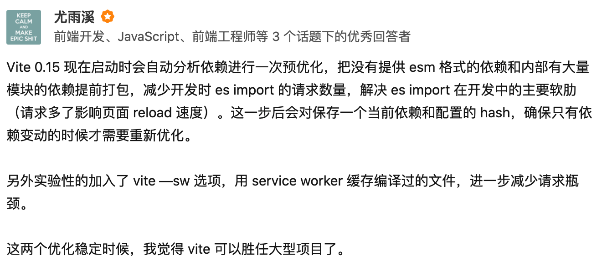
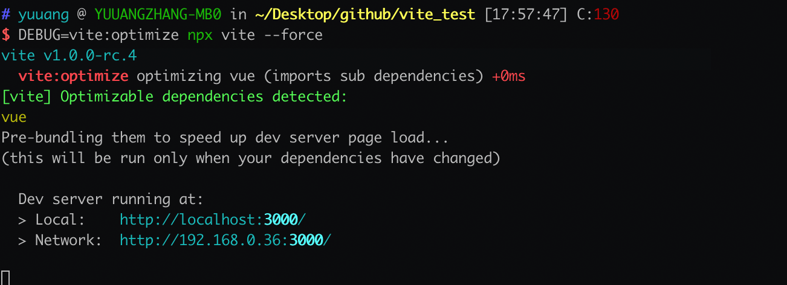
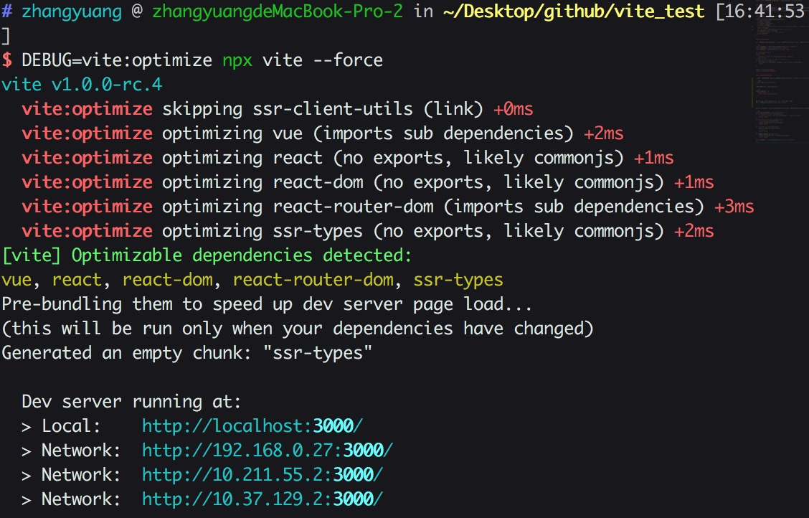
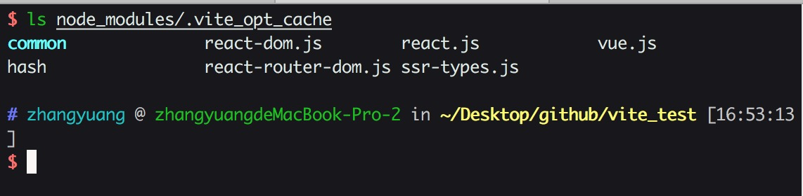
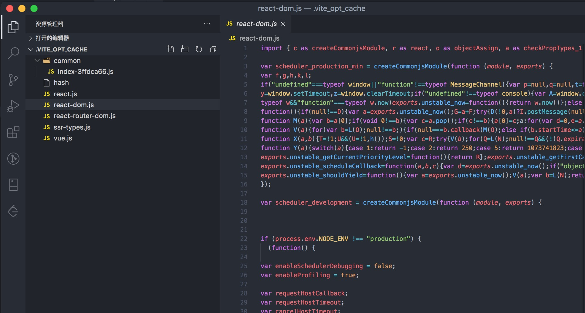

# 预优化



借用 Vite 作者的原话大家可以很清晰的认识到 optimize 的作用。接下来让我们从源码层面分析一下 Vite 究竟是如何实现的。本章主要分析的是 `src/node/optimizer/index.ts`

首先我们找到调用 optimize 方法的入口

```js
// src/node/server/index.ts
server.listen = (async (port: number, ...args: any[]) => {
    if (optimizeDeps.auto !== false) {
        await require('../optimizer').optimizeDeps(config)
    }
    context.port = port
    return listen(port, ...args)
}) as any
```

我们可以看到预优化的进行是在在服务启动成功之前。

## 定义缓存文件夹

被 Vite 预处理后的文件都将放置在该文件夹

```js
export const OPTIMIZE_CACHE_DIR = `node_modules/.vite_opt_cache`
```

## 总览 optimize

同样按照上一章分析的方法。我们通过 debug 模块的输出来总览 optimize 处理的模块

由于 optimize 自身有 cache 机制。所以为了准确看到 Vite 处理了哪些模块。这里加上 `--force` 选项来绕过 cache。这里我们可以看到 Vue 被处理了。

## 分析type

通过这个接口我们可以很容易的看出 optimize 到底具备什么能力
```js
export interface DepOptimizationOptions {
  // 需要被处理的依赖
  include?: string[]
  // 不需要被处理的依赖
  exclude?: string[]
  // 在 link 中指定的依赖不会被 optimize 处理，因为需要防止被缓存。而依赖的依赖会被优化。在 monorepo 这种架构中使用。(monorepo架构 可参考 lerna)
  link?: string[]
  // 使用 node 原生模块，但是不直接在浏览器中使用
  allowNodeBuiltins?: string[]
  // 是否在启动时自动执行 vite optimize
  auto?: boolean
}
```

## 创建缓存文件夹

通过下列代码，如果没有指定 --force 选项并且本次 hash 值与上一次的相等则说明 cache 无变化可以直接使用，否则删除 cache 并重新创建

```js
const cacheDir = resolveOptimizedCacheDir(root, pkgPath)!
const hashPath = path.join(cacheDir, 'hash')
const depHash = getDepHash(root, config.__path)

if (!config.force) {
let prevhash
try {
    prevhash = await fs.readFile(hashPath, 'utf-8')
} catch (e) {}
// hash is consistent, no need to re-bundle
if (prevhash === depHash) {
    log('Hash is consistent. Skipping. Use --force to override.')
    return
}
}

await fs.remove(cacheDir)
await fs.ensureDir(cacheDir)
```

## 找到需要优化的依赖

为了更加全面的分析 optimize 的功能，这里我额外安装一个依赖 [ssr-client-utils](https://github.com/ykfe/ssr/tree/dev/packages/client-utils) 用来测试。

```bash
$ yarn add ssr-client-utils
```

安装完成后创建 `vite.config.js`

```js
module.exports = {
  optimizeDeps: {
    link: ['ssr-client-utils']
  }
}
```

这里我们将 `ssr-client-utils` 作为 link 选项加入。
运行 `DEBUG=vite:optimize npx vite --force`

可以看到 `ssr-client-utils` 由于在 link 中指定了。所以被跳过处理了。而 `ssr-client-utils` 自身的依赖，如 `react` `react-dom` 则被 optimize 并且处理后的结果存在于缓存文件夹当中。


接下来我们正式分析 `const { qualified, external } = resolveQualifiedDeps(root, options, resolver)`
到底做了什么。

## resolveQualifiedDeps

首先我们读取了当前应用的 dependencies 并且筛选出需要优化的依赖。

```json
{
  "name": "vite_test",
  "version": "0.0.0",
  "scripts": {
    "dev": "vite",
    "build": "vite build"
  },
  "dependencies": {
    "ssr-client-utils": "^0.2.33",
    "vue": "^3.0.0-rc.1"
  },
  "devDependencies": {
    "@vue/compiler-sfc": "^3.0.0-rc.1",
    "vite": "^1.0.0-rc.1"
  }
}
```

```js
const qualifiedDeps = deps.filter((id) => {
if (include && include.includes(id)) {
    // 已经在 include 选项中指定了这里无需再加入qualifiedDeps
    return false
}
if (exclude && exclude.includes(id)) {
    // exclude 的选项不需要优化
    debug(`skipping ${id} (excluded)`)
    return false
}
if (link && link.includes(id)) {
    debug(`skipping ${id} (link)`)
    // link 选项中指定的依赖需要跳过不进行处理, 所以这里跳过 ssr-client-utils
    return false
}
if (KNOWN_IGNORE_LIST.has(id)) {
    // 存在于 白名单的依赖不要被优化
    debug(`skipping ${id} (internal excluded)`)
    return false
}
const pkgInfo = resolveNodeModule(root, id, resolver) // 读取模块信息
})
```
这里我们的 dependencies 中需要被 optimize 的依赖只有 Vue。link 的模块如 ssr-client-utils 的依赖信息会在下面被收集。我们在下面的内容再分析

### 获取模块信息

接下来让我们看看 resolveNodeModule 干了什么

```js
// src/node/resolver.ts
// 首先我们找到依赖的 package.json /Users/zhangyuang/Desktop/github/vite_test/node_modules/vue/package.json
pkgPath = resolveFrom(root, `${id}/package.json`)
// 根据默认的数组顺序，从 package.json 中读取符合要求的字段
// 这里我们的模块都符合规范具有 main 和 module 这两个通常情况分别代表 commonjs 和 esmodule 格式的字段
// 根据规范，我们优先匹配文件模块格式能为 esmodule 格式的字段 dist/vue.runtime.esm-bundler.js
export const mainFields = ['module', 'jsnext', 'jsnext:main', 'browser', 'main']

if (!entryPoint) {
    for (const field of mainFields) {
        if (typeof pkg[field] === 'string') {
            entryPoint = pkg[field]
            break
        }
    }
}
let entryFilePath: string | undefined

// respect user manual alias
const aliased = resolver.alias(id)
if (aliased && aliased !== id) {
    // entryFilePath 是用户手动在配置中指定的 alias。这里我们没有指定alias 所以为 undefined
    entryFilePath = resolveNodeModuleFile(root, aliased)
}
if (!entryFilePath && entryPoint) {
    entryFilePath = path.join(path.dirname(pkgPath), entryPoint!)
    // entryFilePath 为绝对路径 /Users/zhangyuang/Desktop/github/vite_test/node_modules/vue/dist/vue.runtime.esm-bundler.js
    const postfix = resolveFilePathPostfix(entryFilePath) // resolveFilePathPostfix 用来获取准确的包括具体文件后缀名的完整path
    if (postfix) {
        entryPoint += postfix
        entryFilePath += postfix
    }
    entryPoint = path.posix.join(id, entryPoint!) // 将 id 与 module格式的文件名 join 起来得到 vue/dist/vue.runtime.esm-bundler.js
    // save the resolved file path now so we don't need to do it again in
    // resolveNodeModuleFile()
    nodeModulesFileMap.set(entryPoint, entryFilePath)
}
// 最终我们得到了这个依赖我们需要的完整信息
const result: NodeModuleInfo = {
    entry: entryPoint!, // module 字段指向的具体文件
    entryFilePath, //  module 字段指向的具体文件的绝对路径
    pkg // 依赖的 package.json 完整信息
}
```

以 Vue 为例，我们最终得到的 pkgInfo 如下

```js
{
  entry: 'vue/dist/vue.runtime.esm-bundler.js',
  entryFilePath: '/Users/zhangyuang/Desktop/github/vite_test/node_modules/vue/dist/vue.runtime.esm-bundler.js',
  pkg: {
    name: 'vue',
    version: '3.0.0-rc.5',
    description: 'vue',
    main: 'index.js',
    module: 'dist/vue.runtime.esm-bundler.js',
    types: 'dist/vue.d.ts',
    unpkg: 'dist/vue.global.js',
    jsdelivr: 'dist/vue.global.js',
    files: [ 'index.js', 'dist' ],
    buildOptions: { name: 'Vue', formats: [Array] },
    repository: { type: 'git', url: 'git+https://github.com/vuejs/vue-next.git' },
    keywords: [ 'vue' ],
    author: 'Evan You',
    license: 'MIT',
    bugs: { url: 'https://github.com/vuejs/vue-next/issues' },
    homepage: 'https://github.com/vuejs/vue-next/tree/master/packages/vue#readme',
    dependencies: {
      '@vue/shared': '3.0.0-rc.5',
      '@vue/compiler-dom': '3.0.0-rc.5',
      '@vue/runtime-dom': '3.0.0-rc.5'
    },
    devDependencies: {
      lodash: '^4.17.15',
      marked: '^0.7.0',
      'todomvc-app-css': '^2.3.0'
    }
  }
}
```

### 编译入口文件

这里同样使用上一章节提到过的 [es-module-lexer](https://www.npmjs.com/package/es-module-lexer) 来进行词法分析。
如果模块不包含 exports 关键字。则认为是 commonjs 模块

```js
const content = fs.readFileSync(entryFilePath, 'utf-8')
const [imports, exports] = parse(content)
if (!exports.length && !/export\s+\*\s+from/.test(content)) {
    debug(`optimizing ${id} (no exports, likely commonjs)`)
    return true
}
```

如果包含 exports 关键字，我们便认为是 esmodule 进一步分析 import 导入关系。
如果 import 导入的模块是以 `'.'` 开头的话，则认为是 relative imports。相对导入。否则认为是子依赖。这里输出的日志主要是方便我们知道我们的依赖到底包含哪种类型的依赖。

```js
for (const { s, e } of imports) {
    let i = content.slice(s, e).trim()
    i = resolver.alias(i) || i
    if (i.startsWith('.')) {
        debug(`optimizing ${id} (contains relative imports)`)
        return true
    }
    if (!deps.includes(i)) {
        debug(`optimizing ${id} (imports sub dependencies)`)
        return true
    }
}
```

接下来我们将需要处理的依赖收集起来

```js
qualifiedDeps.forEach((id) => {
    qualified[id] = resolveNodeModule(root, id, resolver)!.entryFilePath!
})
// qualifiedDeps 在本例子中为, ssr-client-utils 的分析结果我们在下面针对 link 的代码再贴出来
{
  vue: '/Users/zhangyuang/Desktop/github/vite_test/node_modules/vue/dist/vue.runtime.esm-bundler.js'
}
```

然后是不需要处理，需要用 external 进行 `外置` 的依赖
如果在当前应用的依赖中有，但是在qualifiedDeps中没有的依赖或者通过 alias 指定的依赖需要外置。

```js
const external = deps
    .filter((id) => !qualifiedDeps.includes(id))
    // make sure aliased deps are external
    // https://github.com/vitejs/vite-plugin-react/issues/4
    .map((id) => resolver.alias(id) || id)
```

### 处理 link 选项中指定的模块

这里做的事情也很简单。我们可以看到，这里我们在 link 中指定了 ssr-client-utils。于是我们没有处理  ssr-client-utils 但是需要处理它的依赖。所以首先读取到了它的 package.json
这里它依赖了 react react-dom 这些模块。处理方法我们同样使用的是上面提到的 resolveQualifiedDeps 方法

```js
if (options.link) {
    options.link.forEach((linkedDep) => {
      const depRoot = path.dirname(
        resolveFrom(root, `${linkedDep}/package.json`)
      )
      const { qualified: q, external: e } = resolveQualifiedDeps(
        depRoot,
        options,
        resolver
      )
      Object.keys(q).forEach((id) => {
        if (!qualified[id]) {
          qualified[id] = q[id]
        }
      })
      e.forEach((id) => {
        if (!external.includes(id)) {
          external.push(id)
        }
      })
    })
  }
```

最终的处理结果是

```js
// qualified 需要被 optimize 的依赖
{
  'react': '/Users/zhangyuang/Desktop/github/vite_test/node_modules/react/index.js',
  'react-dom': '/Users/zhangyuang/Desktop/github/vite_test/node_modules/react-dom/index.js',
  'react-router-dom': '/Users/zhangyuang/Desktop/github/vite_test/node_modules/react-router-dom/esm/react-router-dom.js',
  'ssr-types': '/Users/zhangyuang/Desktop/github/vite_test/node_modules/ssr-types/esm/index.js'
}
// external 不需要被 optimize 的依赖
[ 'ssr-client-utils' ]
```

### 使用 rollup 处理依赖

下面就是我们熟悉的 rollup 打包环节了。之前没有使用过 rollup 也没关系。配置项与 webpack 十分的类似。
我们打包的目的主要有两个
1、将模块处理为 esmodule 格式
2、将由多个依赖的模块提前打包成一个文件，减少文件加载数量

```js
const rollup = require('rollup') as typeof Rollup

const bundle = await rollup.rollup({
    input: qualified,
    external,
    // treeshake: { moduleSideEffects: 'no-external' },
    onwarn: onRollupWarning(spinner, options),
    ...config.rollupInputOptions,
    plugins: [
        depAssetExternalPlugin,
        ...(await createBaseRollupPlugins(root, resolver, config)),
        createDepAssetPlugin(resolver, root)
    ]
})

const { output } = await bundle.generate({
    ...config.rollupOutputOptions,
    format: 'es',
    exports: 'named',
    entryFileNames: '[name].js',
    chunkFileNames: 'common/[name]-[hash].js'
})
```


我们可以看到模块的格式都被处理成了 esmodule 


