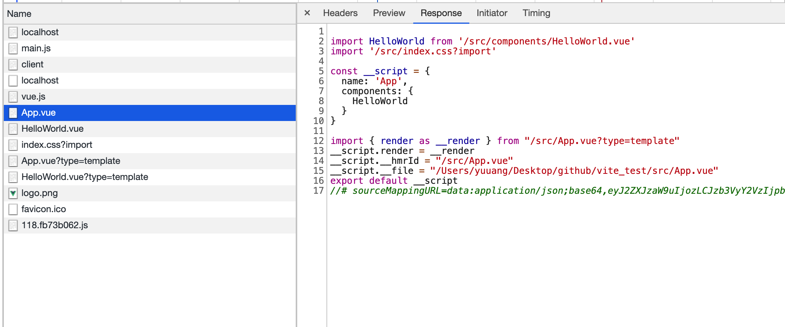
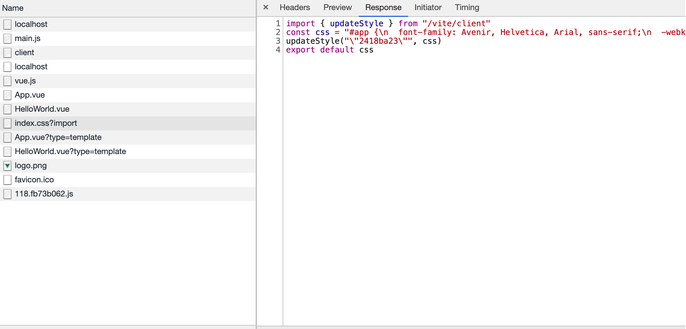

# 组件渲染

前面的章节我们说到了本地文件在发送给浏览器之前是会根据文件类型做不同的 transfrom 代码转换的。

观察一下我们实际在浏览器中加载的文件内容。可以看到表面我们加载的是一个 .vue 组件。但是文件的实际内容还是传统的 .js 文件，并且 Content-Type 也是 `application/javascript; charset=utf-8`
所以浏览器才能够直接运行该文件。并且我们可以发现不同的文件类型后面跟的 query type 参数也不一样。有 `?type=template` `?type=import`。下面让我们来具体分析一下一个 Vue 组件是如何在浏览器中被渲染的吧

## 处理 css 文件

浏览器是不支持直接 import 导入 .css 文件的。如果你配置过 webpack 来处理 css 文件，那么你应该清楚这类问题的解决方式要么是将 css 编译成 js 文件，要么是把组件中的 css 单独提取为 css文件通过 link 标签来进行加载。Vite 在本地开发时采用的是第一种方式，在生产环境构建时仍然是编译成独立的 css 文件进行加载。

### 挂载样式

Vite 使用 serverPluginCss 插件来处理形如 `http://localhost:3000/src/index.css?import` 这样的以.css为后缀结尾且 query 包含 import 的请求。

```js
// src/node/server/serverPluginCss.ts
const id = JSON.stringify(hash_sum(ctx.path))
if (isImportRequest(ctx)) {
    const { css, modules } = await processCss(root, ctx) // 这里主要对css文件做一些预处理之类的操作如 less->css, postcss之类的处理不在此处详细展开
    console.log(modules)
    ctx.type = 'js'
    ctx.body = codegenCss(id, css, modules)
}
export function codegenCss(
  id: string,
  css: string,
  modules?: Record<string, string>
): string {
  let code =
    `import { updateStyle } from "${clientPublicPath}"\n` +
    `const css = ${JSON.stringify(css)}\n` +
    `updateStyle(${JSON.stringify(id)}, css)\n`
  if (modules) {
    code += `export default ${JSON.stringify(modules)}`
  } else {
    code += `export default css`
  }
  return code
}
```

在上面的代码中，我们劫持了 css 文件的请求以及重写了请求的响应。将 css 文件改写为 esmodule 格式的js文件。如果启用了 css-modules 则我们导出一个具体对象。因为组件需要使用 `:id=styles.xxx` 的形式来引用。对于普通的 css 文件则无需导出具体有意义的对象。这里的核心方法是 updateStyle，让我们来看看这个方法到底干了什么。

### updateStyle

从 `http://localhost:3000/src/index.css?import` 请求的详细响应信息可以看出。实质是 Vite 是通过 `updateStyle` 这个方法来将 css 字符串挂载到具体的 dom 元素上


```js
export function updateStyle(id: string, content: string) {
  let style = sheetsMap.get(id)
  if (supportsConstructedSheet && !content.includes('@import')) {
    if (style && !(style instanceof CSSStyleSheet)) {
      removeStyle(id)
      style = undefined
    }

    if (!style) {
      style = new CSSStyleSheet()
      style.replaceSync(content)
      // @ts-ignore
      document.adoptedStyleSheets = [...document.adoptedStyleSheets, style]
    } else {
      style.replaceSync(content)
    }
  } else {
    if (style && !(style instanceof HTMLStyleElement)) {
      removeStyle(id)
      style = undefined
    }

    if (!style) {
      style = document.createElement('style')
      style.setAttribute('type', 'text/css')
      style.innerHTML = content
      document.head.appendChild(style)
    } else {
      style.innerHTML = content
    }
  }
  sheetsMap.set(id, style)
}
```

updateStyle 中用到的核心 API 是 [CSSStyleSheet](https://developer.mozilla.org/zh-CN/docs/Web/API/CSSStyleSheet)
首先我们在 supportsConstructedSheet 中判断了当前浏览器是否支持 CSSStyleSheet, 如果不支持则采用 style 标签插入的形式挂载样式。
如果支持则创建 CSSStyleSheet 实例。接着将编译后的 css 字符串传入 CSSStyleSheet 实例对象。再将该对象添加进 document.adoptedStyleSheet 就可以让我们的样式生效啦

## 解析 Vue 文件

Vite 在解析 .vue 文件主要做的还是 code transform 将 vue 组件解析成调用 compile 以及 render 方法的 js 文件。具体的 compile 以及 render 的核心逻辑还是在 vue3 的 api 中完成。

```js
// src/node/server/serverPluginVue.ts
const descriptor = await parseSFC(root, filePath, ctx.body)
```
首先用官方提供的库来将单文件组件编译成 descriptor。以 App.vue 为例这里我们摘出比较重要的信息省略 sourcemap信息。

```js
// src/App.vue
{
  filename: '/Users/yuuang/Desktop/github/vite_test/src/App.vue',
  source: '<template>\n' +
    '  \n' +
    '  <div class="small">\n' +
    '    small1\n' +
    '  </div>\n' +
    '  <HelloWorld msg="Hello Vue 3.0 + Vite" />\n' +
    '</template>\n' +
    '\n' +
    '<script>\n' +
    "import HelloWorld from './components/HelloWorld.vue'\n" +
    "import style from './index.module.css'\n" +
    '\n' +
    'export default {\n' +
    "  name: 'App',\n" +
    '  components: {\n' +
    '    HelloWorld\n' +
    '  },\n' +
    '  data() {\n' +
    '    return {\n' +
    '      style: style\n' +
    '    }\n' +
    '  },\n' +
    '  mounted () {\n' +
    "    console.log('mounted')\n" +
    '  }\n' +
    '}\n' +
    '</script>\n' +
    '\n' +
    '<style>\n' +
    '.small {\n' +
    '  width:21px\n' +
    '}\n' +
    '</style>\n' +
    '\n',
  template: {
    type: 'template',
    content: '\n' +
      '  \n' +
      '  <div class="small">\n' +
      '    small1\n' +
      '  </div>\n' +
      '  <HelloWorld msg="Hello Vue 3.0 + Vite" />\n',
    loc: {
      source: '\n' +
        '  \n' +
        '  <div class="small">\n' +
        '    small1\n' +
        '  </div>\n' +
        '  <HelloWorld msg="Hello Vue 3.0 + Vite" />\n',
      start: [Object],
      end: [Object]
    },
    attrs: {},
    map: xxx
  },
  script: {
    type: 'script',
    content: '\n' +
      "import HelloWorld from './components/HelloWorld.vue'\n" +
      "import style from './index.module.css'\n" +
      '\n' +
      'export default {\n' +
      "  name: 'App',\n" +
      '  components: {\n' +
      '    HelloWorld\n' +
      '  },\n' +
      '  data() {\n' +
      '    return {\n' +
      '      style: style\n' +
      '    }\n' +
      '  },\n' 
      '}\n',
    loc: {
      source: '\n' +
        "import HelloWorld from './components/HelloWorld.vue'\n" +
        "import style from './index.module.css'\n" +
        '\n' +
        'export default {\n' +
        "  name: 'App',\n" +
        '  components: {\n' +
        '    HelloWorld\n' +
        '  },\n' +
        '  data() {\n' +
        '    return {\n' +
        '      style: style\n' +
        '    }\n' +
        '  },\n' 
        '}\n',
      start: [Object],
      end: [Object]
    },
    attrs: {},
    map: xxx
  },
  scriptSetup: null,
  styles: [
    {
      type: 'style',
      content: '\n.small {\n  width:21px\n}\n',
      loc: [Object],
      attrs: {},
      map: [Object]
    }
  ],
  customBlocks: []
}
```

通过上述代码我们可以解析出一个组件的 descriptor。拿到解析结果后继续往下判断

```js
if (!query.type) {
      // watch potentially out of root vue file since we do a custom read here
      watchFileIfOutOfRoot(watcher, root, filePath)

      if (descriptor.script && descriptor.script.src) {
        filePath = await resolveSrcImport(
          root,
          descriptor.script,
          ctx,
          resolver
        )
      }
      ctx.type = 'js'
      const { code, map } = await compileSFCMain(
        descriptor,
        filePath,
        publicPath,
        root
      )
      ctx.body = code
      ctx.map = map
      return etagCacheCheck(ctx)
    }

```

首先是针对没有特定 query type 的请求。我们首先判断 script 标签有没有 src 属性。例如 `<script src="./app.js"></script>` 将逻辑单独拆出一个文件进行维护。这种写法在 Vue 中比较少见也不推荐。Vue 推崇单文件组件的写法。接下来就是比较核心的 compileSFCMain 方法了

```js
if (script) {
  content = script.content
  map = script.map
  if (script.lang === 'ts') {
    const res = await transform(content, publicPath, {
      loader: 'ts'
    })
    content = res.code
    map = mergeSourceMap(map, JSON.parse(res.map!))
  }
}
/**
 * Utility for rewriting `export default` in a script block into a varaible
 * declaration so that we can inject things into it
 */
code += rewriteDefault(content, '__script')
```
首先判断如果是 ts 文件则先调用 esbuild 来将 ts 转换为 js。接着使用 rewriteDefault 来重写 export default 的内容到一个变量中。在这里是 `__script`。做完之后 code 的内容为

```js
import HelloWorld from './components/HelloWorld.vue'
import style from './index.module.css'

const __script = {
  name: 'App',
  components: {
    HelloWorld
  },
  data() {
    return {
      style: style
    }
  }
}


import HelloWorld from './components/HelloWorld.vue'
import style from './index.module.css'

const __script = {
  name: 'App',
  components: {
    HelloWorld
  },
  data() {
    return {
      style: style
    }
  }
}

import { render as __render } from "/src/App.vue?type=template"
__script.render = __render
__script.__hmrId = "/src/App.vue"
__script.__file = "/Users/yuuang/Desktop/github/vite_test/src/App.vue"
export default __script
```
接着我们判断组件当中有没有 style 标签

```js
if (descriptor.styles) {
    descriptor.styles.forEach((s, i) => {
      const styleRequest = publicPath + `?type=style&index=${i}`
      if (s.scoped) hasScoped = true
      if (s.module) {
        if (!hasCSSModules) {
          code += `\nconst __cssModules = __script.__cssModules = {}`
          hasCSSModules = true
        }
        const styleVar = `__style${i}`
        const moduleName = typeof s.module === 'string' ? s.module : '$style'
        code += `\nimport ${styleVar} from ${JSON.stringify(
          styleRequest + '&module'
        )}`
        code += `\n__cssModules[${JSON.stringify(moduleName)}] = ${styleVar}`
      } else {
        code += `\nimport ${JSON.stringify(styleRequest)}`
      }
    })
    if (hasScoped) {
      code += `\n__script.__scopeId = "data-v-${id}"`
    }
  }
```

首先判断有没有使用 css-modules 例如 `<style module> xxx </style>`。如果使用了则在 code 中注入 `\nconst __cssModules = __script.__cssModules = {}` 并且在 script 头部插入 `import $style from './index.module.css'` 这样的代码。这样我们就可以直接在 template 中使用 $style.xxx 来使用 css-modules。  
如果是普通的样式文件则直接注入 `\nimport ${JSON.stringify(styleRequest)}` 在 App.vue 中则是 `import "/src/App.vue?type=style&index=0"`  

```js
if (descriptor.template) {
    const templateRequest = publicPath + `?type=template`
    code += `\nimport { render as __render } from ${JSON.stringify(
      templateRequest
    )}`
    code += `\n__script.render = __render`
  }
```
接下来判断如果有 template 则注入 type 为 template 的 import 脚本用来发起请求。在 App.vue 中是 `import {render as __render} from "/src/App.vue?type=template"`  
最后注入一些辅助信息
```js
code += `\n__script.__hmrId = ${JSON.stringify(publicPath)}`
  code += `\n__script.__file = ${JSON.stringify(filePath)}`
  code += `\nexport default __script`
```
最终的完整信息如下

```js
import HelloWorld from '/src/components/HelloWorld.vue'
import style from '/src/index.module.css?import'

const __script = {
    name: 'App',
    components: {
        HelloWorld
    },
    data() {
        return {
            style: style
        }
    }
}

import "/src/App.vue?type=style&index=0"
import {render as __render} from "/src/App.vue?type=template"
__script.render = __render
__script.__hmrId = "/src/App.vue"
__script.__file = "/Users/yuuang/Desktop/github/vite_test/src/App.vue"
export default __script
```

拿到 compileSFCMain 的返回结果后。返回给 ctx.body 渲染。接着由于我们在上面将请求类型划分为了 `template`, `style` 接下来看看我们如何处理各种类型的请求。

```js
 if (query.type === 'template') {
      const templateBlock = descriptor.template!
      if (templateBlock.src) {
        filePath = await resolveSrcImport(root, templateBlock, ctx, resolver)
      }
      ctx.type = 'js'
      const cached = vueCache.get(filePath)
      const bindingMetadata = cached && cached.script && cached.script.bindings
      const vueSpecifier = resolveBareModuleRequest(
        root,
        'vue',
        publicPath,
        resolver
      )
      const { code, map } = compileSFCTemplate(
        root,
        templateBlock,
        filePath,
        publicPath,
        descriptor.styles.some((s) => s.scoped),
        bindingMetadata,
        vueSpecifier,
        config
      )
      ctx.body = code
      ctx.map = map
      return etagCacheCheck(ctx)
    }
```

当 type 为 template 时，我们只需要取 descriptor 的 template 字段。首先判断有没有 src 属性来引用单独拆出来的文件。这种情况使用的也比较少。  
核心的方法调用是 compileSFCTemplate 来将 template 编译成官方提供的 h函数(render 函数)来生成 vnode 进行渲染。

```js
if (query.type === 'style') {
      const index = Number(query.index)
      const styleBlock = descriptor.styles[index]
      if (styleBlock.src) {
        filePath = await resolveSrcImport(root, styleBlock, ctx, resolver)
      }
      const id = hash_sum(publicPath)
      const result = await compileSFCStyle(
        root,
        styleBlock,
        index,
        filePath,
        publicPath,
        config
      )
      ctx.type = 'js'
      ctx.body = codegenCss(`${id}-${index}`, result.code, result.modules)
      return etagCacheCheck(ctx)
    }
```

类型为 style 的请求类似。我们只需要使用 descriptor 的 styles 字段。使用 compileSFCStyle 来进行一些 @import 关键字的处理。最后使用 codegenCss 在外面包上一层调用客户端提供的 `updateStyle` 方法即可。